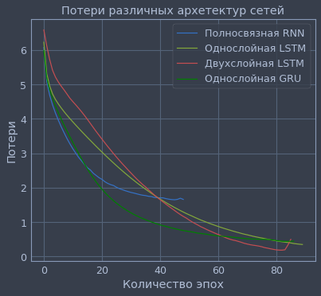

# Отчет по лабораторной работе "Генерация последовательностей"

### Бронников Максим Андреевич, М8О-307Б
Номер в группе: 4, Вариант: 4 ((остаток от деления (4-1) на 6)+1)

### Цель работы
В данной лабораторной работе вам предстоит научиться генерировать последовательности с помощью рекуррентных нейронных сетей. В качестве последовательностей в зависимости выступает проза на английском языке, элемент последовательности - одно слово.

### Используемые входные данные

Несколько книг с сайта https://www.gutenberg.org

### Предварительная обработка входных данных

Для векторизации слов я скачал книги, удалил из них лишнюю информацию, после чего разбил текст на главы. Текст в главах я токенезировал, после чего с помощью Word2Vec технологии получил слова в векторном представлении вместе со словарем. 

Для того, чтобы получаемая последовательность была похожа на те, что производит человек, я решил не производить стэмминг и очистку от знаков препинаний и стоп-слов, что, конечно же идет во вред смысловой составляющей генерирумых последовательностей.

### Эксперимент 1: RNN

#### Архитектура сети

```
Layer (type)                 Output Shape              Param #   
=================================================================
embedding (Embedding)        (128, None, 510)          10380030  
_________________________________________________________________
simple_rnn (SimpleRNN)       (128, None, 1024)         1571840   
_________________________________________________________________
dense (Dense)                (128, None, 20353)        20861825  
=================================================================
Total params: 32,813,695
Trainable params: 32,813,695
Non-trainable params: 0
_________________________________________________________________
```

#### Результат

Пример последовательности, сгенерированной сетью:
```
I predict that it will be best of the circumstantial scandal, with the new friend Mr. Grimwig. Like this, some kind looking twice routed themselves above its originator, her better effect upon the face opposite intentions in his respect habitual feeling absolutely chance to extreme seriousness, he thought: one no'
```

### Эксперимент 2: Однослойная LSTM

#### Архитектура сети

```
_________________________________________________________________
Layer (type)                 Output Shape              Param #   
=================================================================
embedding_1 (Embedding)      (128, None, 510)          10380030  
_________________________________________________________________
lstm (LSTM)                  (128, None, 1024)         6287360   
_________________________________________________________________
dense_1 (Dense)              (128, None, 20353)        20861825  
=================================================================
Total params: 37,529,215
Trainable params: 37,529,215
Non-trainable params: 0
_________________________________________________________________
```

#### Результат

Пример последовательности, сгенерированной сетью:
```
I predict that it will be out his heart, they parted behind the FIRST him too, so the expression ( alas! I repeat Dorian Gray with closed out where can’ t know where i know how came in September Dounia’ s stifling daily in what was nothing about him. ” she
```

### Эксперимент 3: Двухслойная LSTM

#### Архитектура сети

```
_________________________________________________________________
Layer (type)                 Output Shape              Param #   
=================================================================
embedding_2 (Embedding)      (128, None, 510)          10380030  
_________________________________________________________________
lstm_1 (LSTM)                (128, None, 1024)         6287360   
_________________________________________________________________
lstm_2 (LSTM)                (128, None, 1024)         8392704   
_________________________________________________________________
dense_2 (Dense)              (128, None, 20353)        20861825  
=================================================================
Total params: 45,921,919
Trainable params: 45,921,919
Non-trainable params: 0
_________________________________________________________________
```

#### Результат

Пример последовательности, сгенерированной сетью:
```
I predict that it will be necessary that they lie, so fond of harm, that you would do sit down his usual, i must close to her supper for Avdotya Romanovna began all, as he had rented worse. Mortimer, according to find himself. The best. 'that for the'
```

### Эксперимент 4: GRU

#### Архитектура сети

```
_________________________________________________________________
Layer (type)                 Output Shape              Param #   
=================================================================
embedding_3 (Embedding)      (128, None, 510)          10380030  
_________________________________________________________________
gru (GRU)                    (128, None, 1024)         4718592   
_________________________________________________________________
dense_3 (Dense)              (128, None, 20353)        20861825  
=================================================================
Total params: 35,960,447
Trainable params: 35,960,447
Non-trainable params: 0
_________________________________________________________________
```

#### Результат

Пример последовательности, сгенерированной сетью:
```
I predict that it will be too. She was fine day his eyes on, Vronsky felt at self-knowledge, who can promise? If anyone of his wont to ask of politics and motion, that Sviazhsky, i have something fine as well; it soon she added, the care of roses'
```

#### График обучения  моделей:




### Подробное описание

Подробное описание выполненной работы можно изучить в [ноутбуке](GenerationP.ipynb).


### Выводы

В результате мы получили 4 нейронных сети с рекуррентными слоями различных архитектур и посмотрели на то, как каждая из них генерирует последовательности слов и можем оценить насколько сгенерированные последовательности внешне похожи на те, которые производит человек.

Заметим, что все модели нашли некоторые закономерности в том, как грамматически построенны предложения, которые написаны человеком, однако результат нельзя назвать впечатляющим, поскольку то, что произвела модель всё еще далеко от настоящей человечесой письменности. Я думаю, что получил не самый оптимальный результат по той причине, что не достаточно аккуратно и тщательно обработал данные, использовал слишком простую архитектуру сетей, не сделал валидационную выборку для проверки качества на ней. Также, возможно что моя модель просто напросто переобучислась, чего я не обнаружил также из-за отсутствия выборки. Ситуацию могла исправить более точная подборка гиперпараметров, однако сделать это было проблематично, поскольку скорость обучения моделей была недостаточно велика, чтобы попробовать много различных параметров в короткий срок.

Несмотря на то, что я не получил отличного результата при построении своей первой рекурентной сети, я получил огромный бэкграунд при её выполнении, изучил много нового, в том числе познакомился с сервисом Google Collab, поскольку это был единственный для меня бесплатный способ обучать нейронные модели за разумное время.
